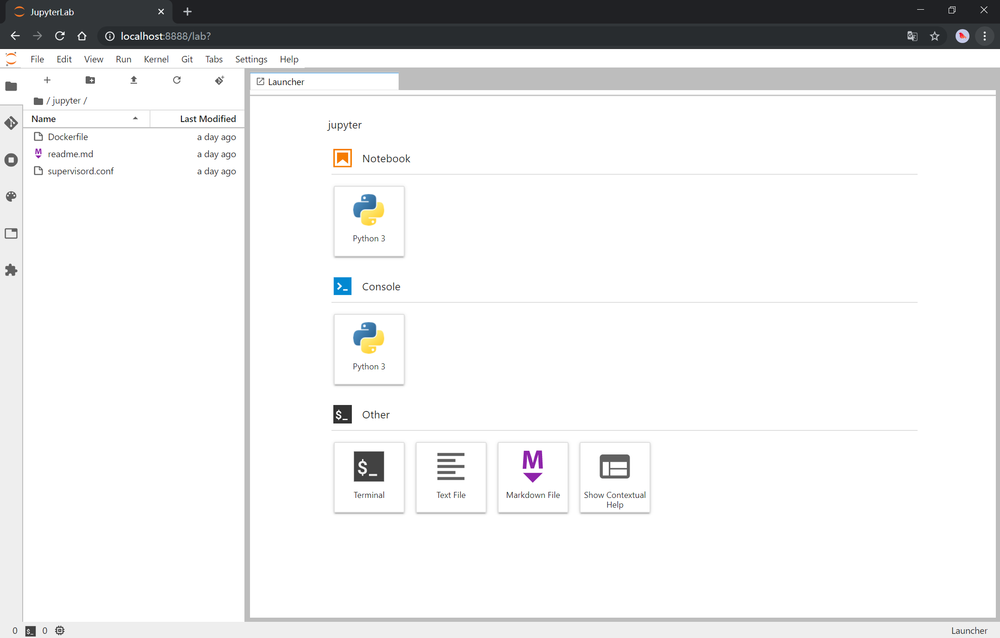

# 下载

```shell
git clone https://github.com/oOxianOo/jupyter-docker.git
```


# 创建 docker 容器

```shell
# 生成 jupyter 的 docker 镜像 
docker build -t jupyter . 
# 启动 jupyter 容器，访问端口为 8888 
docker run -it --name jupyter -p 8888:8888 jupyter bash 
```


# 创建 jupyter 密码

```shell
jupyter notebook password
```


# 启动 jupyter

``` shell
# 前台启动
jupyter-lab

# 用 supervisor 启动
pip install supervisor
supervisord -c /etc/supervisord.conf  # .conf 文件在生成镜像的时候已复制到 /etc/supervisord.conf 目录下
```

# 打开

```
# 本地打开
localhost:8888
# 远程打开
本机ip:8888
```




